This year's Game On Expo has come to an end, and we're excited to share that our mahjong room welcomed more than 200 visitors! On Saturday alone, we saw almost 100 visits and completely filled 9 tables (including 3 autotables).

We also witnessed not just one, but *two* yakuman hands over the weekend - both of them suuankou (four concealed triplets). Congratulations!


  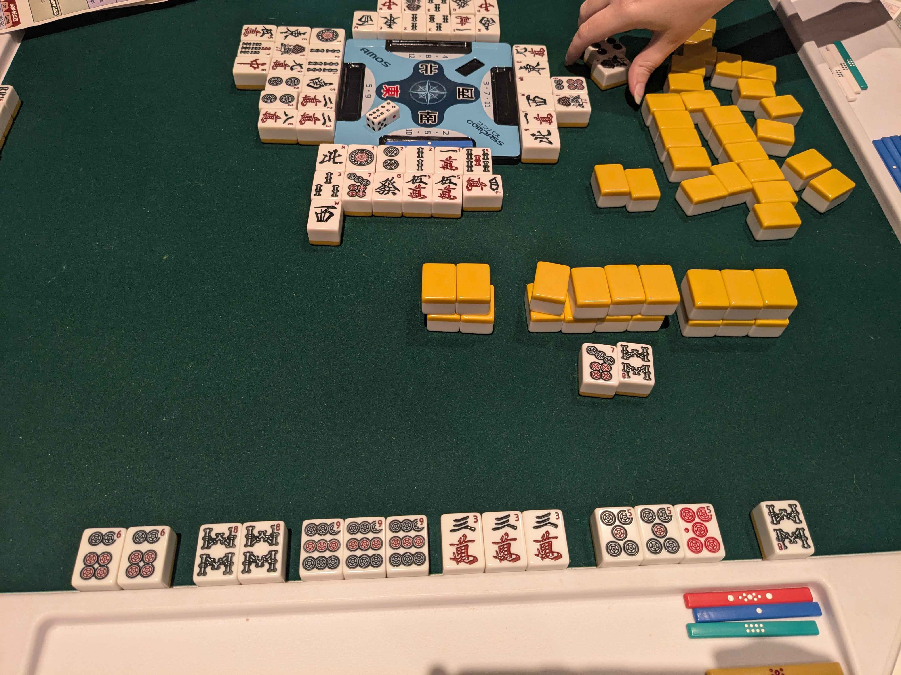
  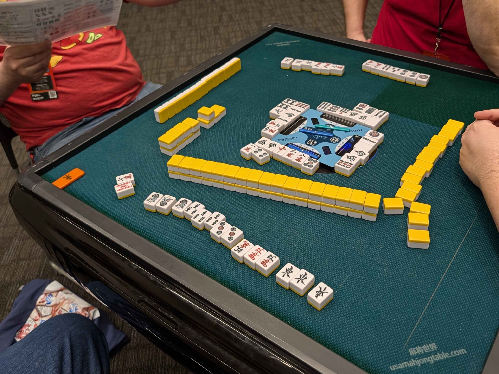


We hope you had as much fun learning and playing as we did teaching. If you're in the Phoenix or Tucson metro areas, you're welcome at one of our [local meetups](/about/#locations). Our Tempe meetup will resume this Wednesday, March 18.

We'd also like to thank the Game On organizers for having us, and our volunteers for all their help with teaching and logistics. And of course, thank you for being part of such an amazing weekend. Here's to the next con!


  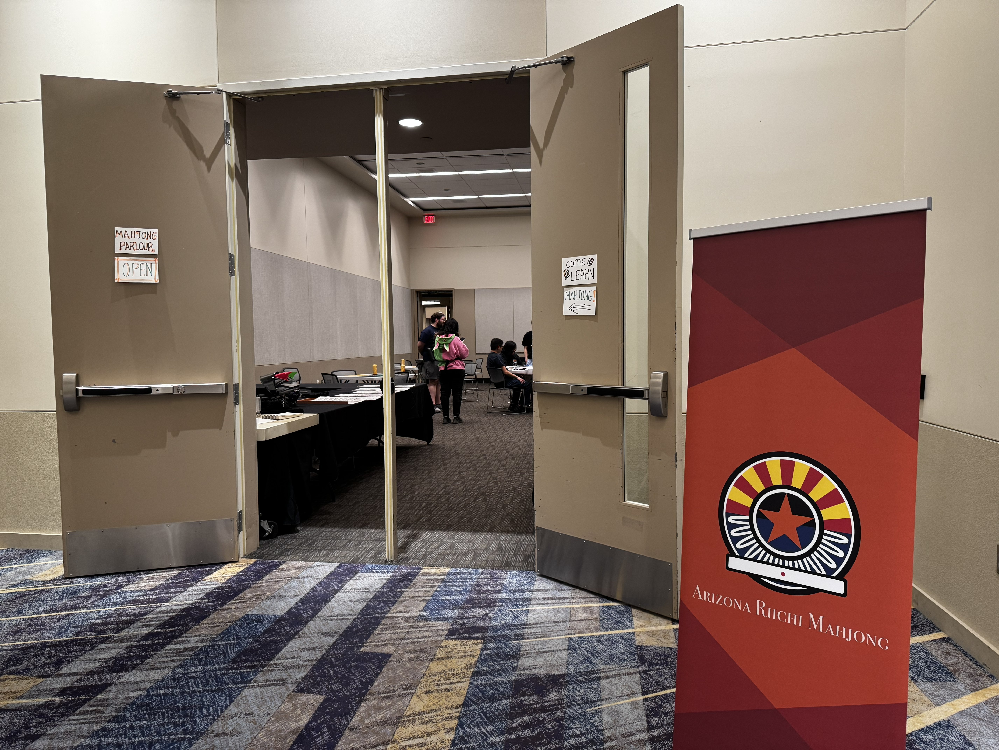
  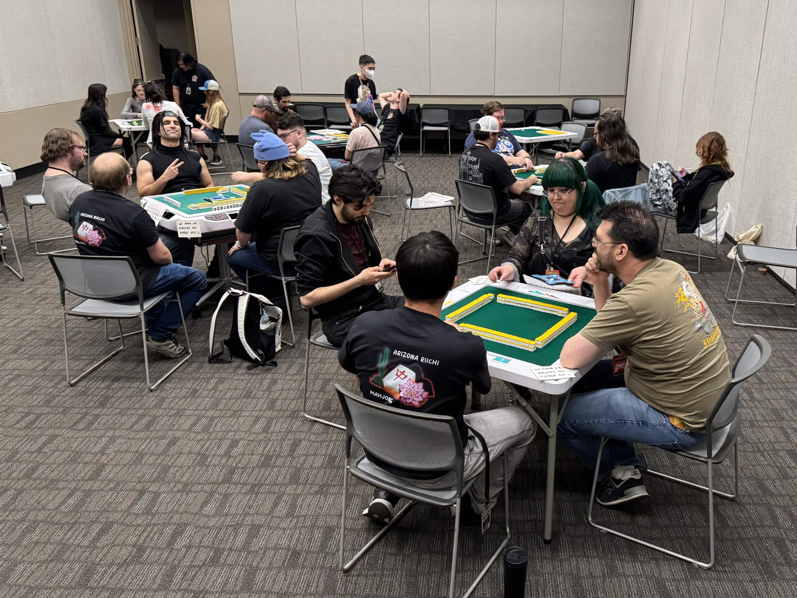
  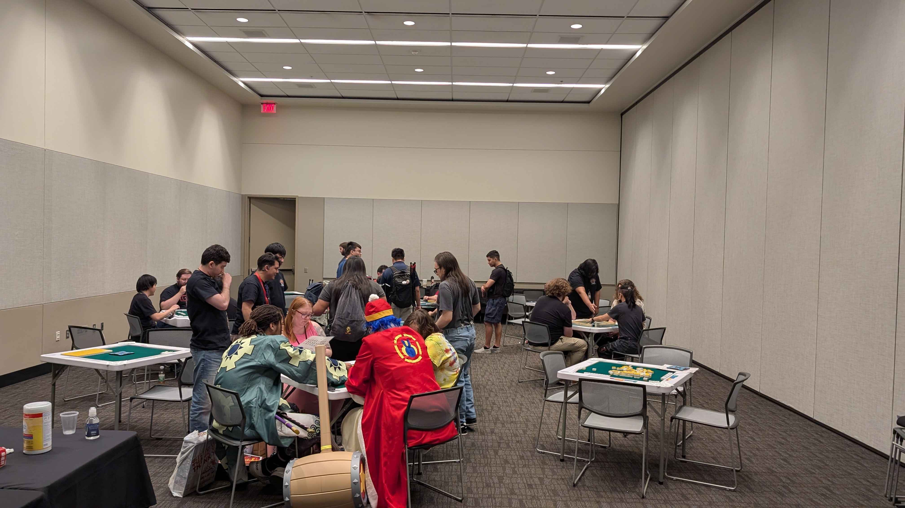
  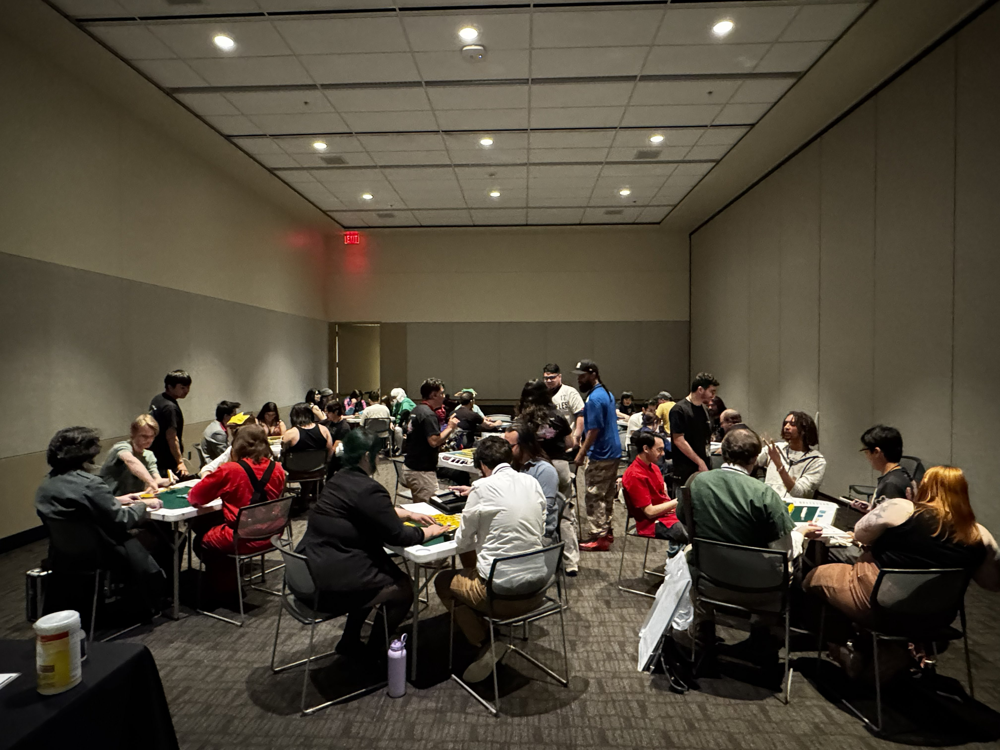
  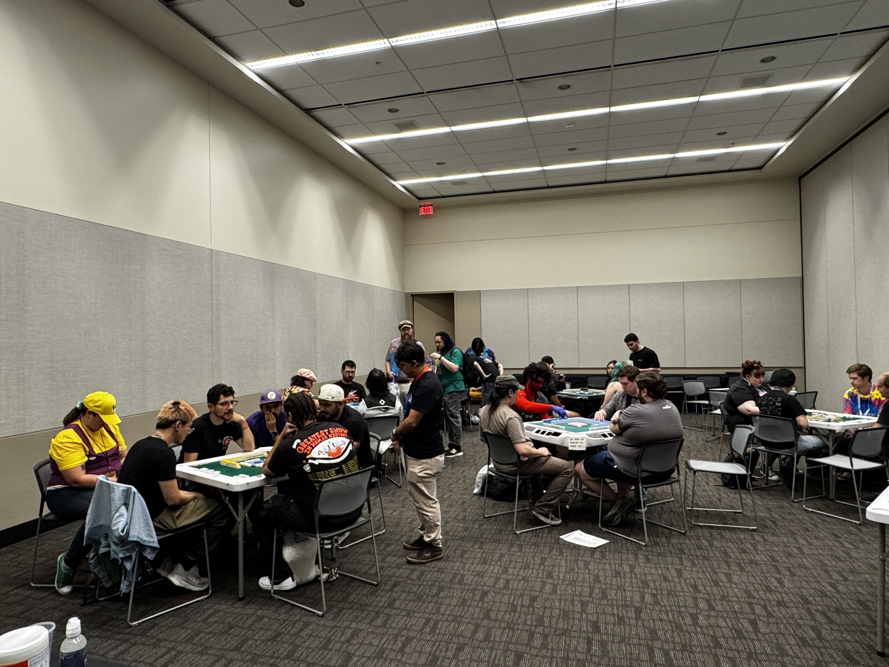
  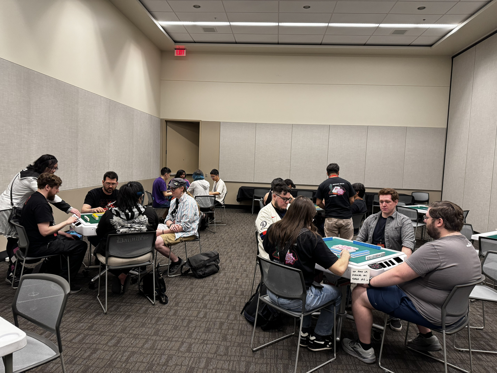
  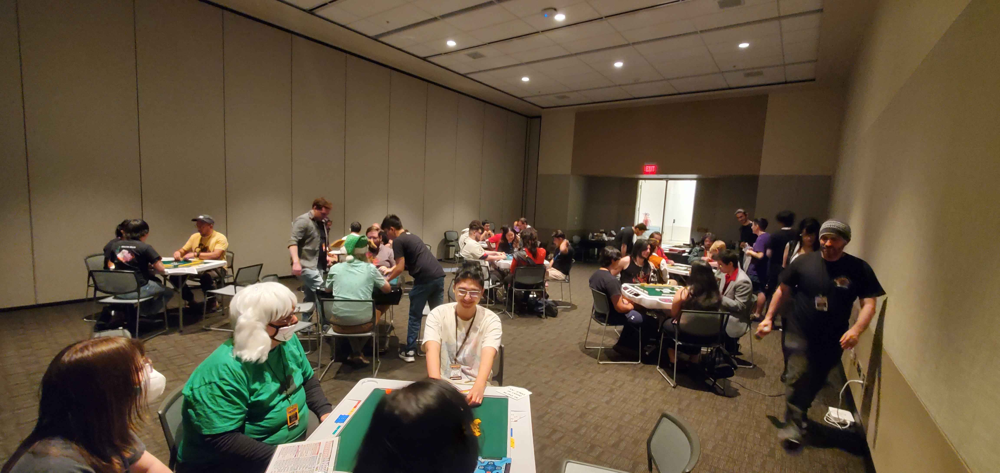
  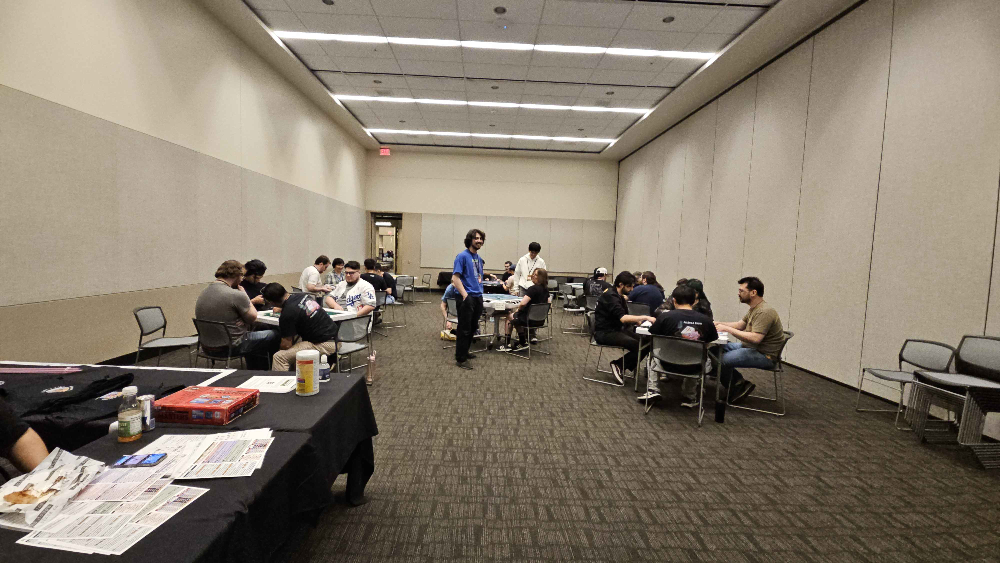
  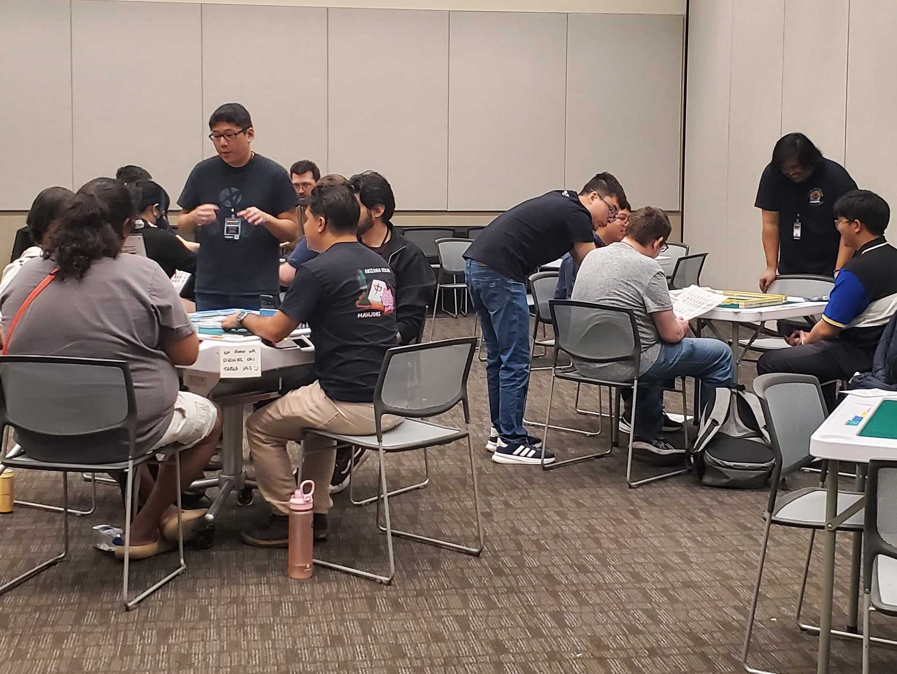
  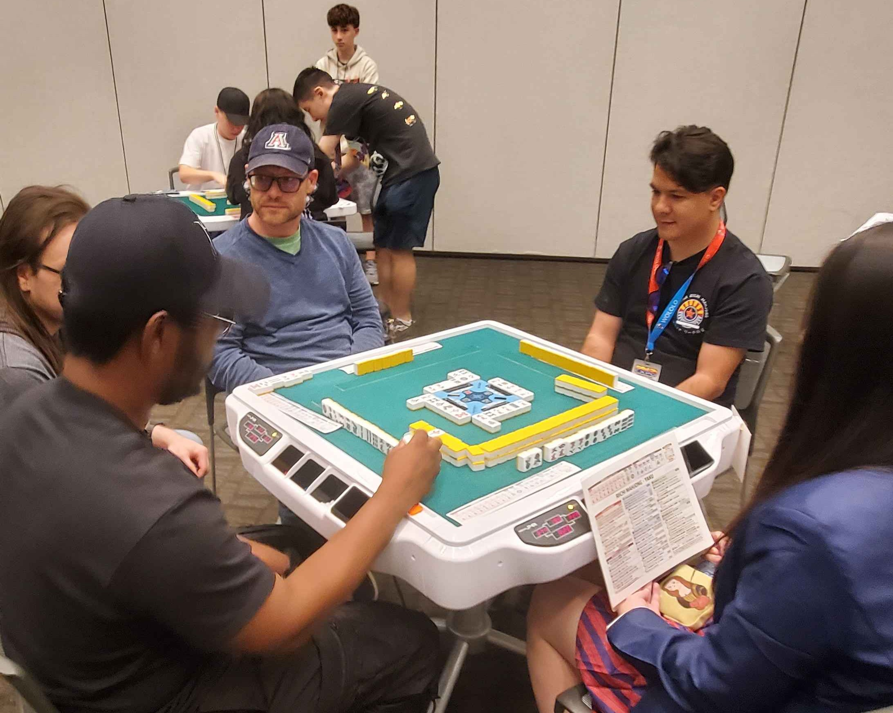
